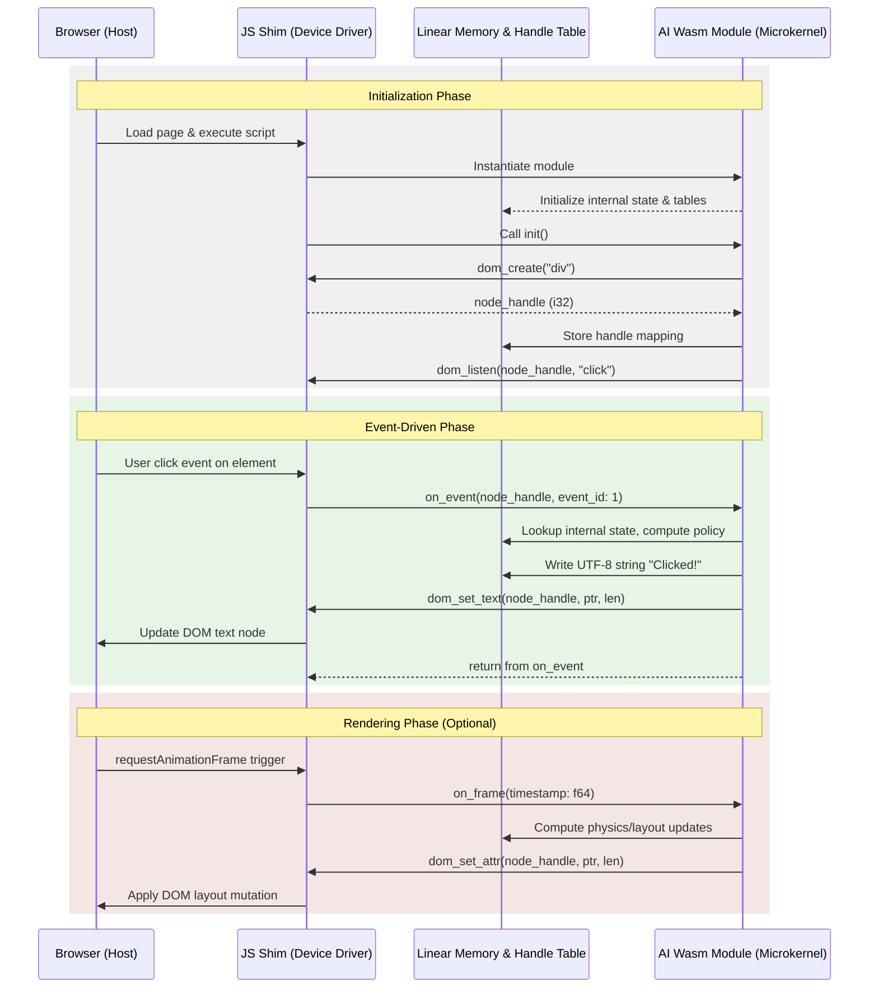

# The Last Stack: Isomorphic AI-Native Client Architecture

**Version 1.0 - March 2026**

## Abstract

This paper extends the LastStack server-side architecture (see `docs/white-paper.md`, v1.2) to client execution environments. It introduces a **isomorphic client architecture** in which all application policy, layout, and state reside in AI-generated WebAssembly modules, and the browser is treated as a minimal host substrate—a window-system microkernel. This document applies the same empirical, evidence-first methodology and conformance-level model as the server-side specification: claims are grounded in observable repository state, conformance levels are measurement-based rather than aspirational, and hypotheses are falsifiable.

The client architecture is a direct extension of the LastStack thesis:

> Canonical behavior is LLVM IR. Contracts are machine obligations. Release is gate-driven.

On the client, "canonical behavior is Wasm." The browser exposes a narrow syscall ABI; all policy lives in a formally specified, agent-generated module.

---

## 1. Empirical Baseline (Repository State)

Baseline commit for this assessment: `fbf810c` (`master`, March 4, 2026).

Observed client-relevant facts:

- No client Wasm module presently exists in this repository.
- No JS shim or browser ABI is implemented.
- `demo/webserver/` demonstrates the server-side pattern and is the closest analogue: a minimal IR-compiled binary with a narrow, explicitly defined syscall surface.
- Structural graph comment infrastructure (`@module`, `@fn`, `@calls`, etc.) and `tools/extract-graph` are the current agent-navigable annotations layer; this infrastructure applies equally to client Wasm as to server IR.
- CI benchmark reporting is operational and provides the measurement baseline for any performance hypotheses.

This paper does not claim client implementation exists. It specifies what a conformant client implementation must contain and provides a conformance-level ladder analogous to the one defined in `docs/white-paper.md`.

---

## 2. Extended Thesis

The server-side LastStack thesis has four non-negotiable constraints (reproduced from v1.2):

1. Canonical behavior is LLVM IR.
2. Agent interface is text plus structure.
3. Contracts are machine obligations, not prose.
4. Release is gate-driven.

The client architecture adds one constraint and refines two:

5. **The browser is a device substrate, not a runtime.**
   All policy, layout, and state reside in a Wasm module. The browser exposes only primitive host syscalls.

The refinements:

- **Constraint 1 (refined):** On the client, canonical behavior is **Wasm** (binary or WAT). LLVM IR remains an optional, recommended intermediate for optimization passes and formal verification.
- **Constraint 3 (refined):** Client-exported PCF contracts apply to Wasm-exported functions, not only to server IR symbols. The same `laststack.pcf.v1` schema governs both.

---

## 3. Architecture

### 3.1 Isomorphic Execution Model

An **isomorphic codebase** is defined operationally: internal program representations are directly and verifiably preserved in the deployment artifact. On the server, LLVM IR is the canonical representation. On the client, WebAssembly is the canonical representation. Both satisfy the same structural requirements:

- Deterministic semantics: no hidden scheduling, reconciliation, or reactive framework policies.
- Extractable structure: agent tooling can parse, annotate, and reason about the module without executing it.
- Verifiable contracts: exported functions carry PCF metadata (`pre`, `post`, `effects`, `bind`, `proof`).

No JavaScript framework, virtual DOM, reactive state manager, or macro-expanded DSL is present. These are not simplifications; they are semantic constraints. Human ergonomic layers introduce non-determinism, hidden side effects, and opaque scheduling that prevent machine-checkable correctness proofs.

### 3.2 Browser as Microkernel

The browser is treated as a **microkernel device**: it owns no policy. It exposes an irreducible set of host primitives via a **JS shim**—a thin (~50 line) driver that:

1. Instantiates the Wasm module.
2. Exposes a syscall ABI (DOM operations, timing, event forwarding).
3. Converts host events into re-entrant calls back into Wasm.

The shim is not a runtime. It has no scheduler, no state, no policy. Every behavioral decision is made inside the Wasm module.

### 3.3 Architecture Diagram

The execution boundary between the host browser and the AI-generated Wasm module is strictly formalized. No business logic or state resides in the JavaScript layer.



### 3.4 Syscall ABI (Normative)


The following ABI is the **complete and exclusive** interface between the Wasm module and the host. The shim must not expose additional operations outside this set without explicit versioned extension.

**ABI version:** `laststack.client.abi.v1`

| Syscall | Signature | Description |
|---|---|---|
| `dom_create` | `(tag_ptr: i32, tag_len: i32) -> i32` | Create a DOM element; returns an opaque handle. |
| `dom_append` | `(parent: i32, child: i32) -> ()` | Append child node to parent. |
| `dom_set_text` | `(node: i32, ptr: i32, len: i32) -> ()` | Set text content of a node. |
| `dom_set_attr` | `(node: i32, k_ptr: i32, k_len: i32, v_ptr: i32, v_len: i32) -> ()` | Set a node attribute. |
| `dom_listen` | `(node: i32, event_id: i32) -> ()` | Register an event listener by event class id. |
| `dom_remove` | `(node: i32) -> ()` | Detach and release a node handle. |
| `perf_now` | `() -> f64` | Monotonic time in milliseconds. |
| `raf_request` | `(callback_id: i32) -> ()` | Request animation frame callback (optional, animation only). |

Handle namespace: opaque `i32` values, allocated by the shim, released by `dom_remove`. The shim maintains a private table; the Wasm module treats handles as uninterpreted integers.

String convention: UTF-8 encoded in Wasm linear memory. All string syscalls accept `(ptr, len)` pairs. The shim reads from Wasm memory using `WebAssembly.Memory`.

Event forwarding: the shim calls the Wasm export `on_event(node: i32, event_id: i32)` on each registered event. No event data is passed beyond node identity and event class—detailed event properties must be retrieved via additional syscalls if needed (future ABI extension).

### 3.5 Wasm Module Requirements (Normative)

A conformant Wasm module must:

- Export `init() -> ()`: called once by the shim after instantiation; builds initial DOM and registers handlers.
- Export `on_event(node: i32, event_id: i32) -> ()`: receives all forwarded events.
- Import only syscalls enumerated in §3.4.
- Not import any JavaScript library functions, framework bindings, or runtime helpers outside the defined ABI.
- Maintain all state in linear memory; no mutable globals visible to the host.

Optional export: `on_frame(timestamp: f64) -> ()`, called by the shim from `requestAnimationFrame` when animation is required. Not required for purely input-driven systems.

### 3.6 Structural Graph Layer

The same structural graph comment conventions defined in `docs/white-paper.md §3.1` apply to client WAT/Wasm sources:

- Node tags: `@module`, `@fn`, `@global`, `@type`
- Edge tags: `@calls`, `@reads`, `@writes`, `@exports`, `@emits`
- Contract-adjacent tags: `@pre`, `@post`, `@effects`, `@proof`

`tools/extract-graph` is extended (or a parallel tool provided) to parse WAT comment syntax. Structural invariants are identical to the server-side requirements.

### 3.7 Contract Layer (Normative)

Every Wasm-exported function must carry a PCF metadata block conforming to `laststack.pcf.v1` (as specified in the server-side whitepaper). Required fields:

- `pcf.schema`: `laststack.pcf.v1`
- `pcf.pre`, `pcf.post`
- `pcf.effects`: drawn from the canonical effect atom vocabulary
- `pcf.bind`
- `pcf.proof`
- `pcf.toolchain`

Client-specific effect atoms (additions to the server atom vocabulary):

| Atom | Meaning |
|---|---|
| `dom.create` | Allocates a DOM node handle. |
| `dom.mutate` | Modifies an existing DOM node. |
| `dom.remove` | Releases a DOM node handle. |
| `dom.listen` | Registers an event listener. |
| `host.time` | Reads monotonic time. |
| `host.raf` | Requests an animation frame. |

Matching rule: `actual_effects ⊆ declared_effects`. Any unresolved atom is a release failure, identical to server policy.

### 3.8 Artifact Seal and TCB Capture

Client release artifacts must emit a manifest conforming to `laststack.artifact.v1` (schema defined in the server-side whitepaper). Client-specific additions to the manifest:

- `wasm_digest`: SHA-256 of the deployed `.wasm` binary.
- `shim_digest`: SHA-256 of the JS shim file.
- `abi_version`: `laststack.client.abi.v1`
- `wat_source_digest`: SHA-256 of the WAT source (if WAT is the canonical source).

TCB scope for client builds additionally includes:

- Wasm compiler/assembler used (e.g., `wat2wasm`, LLVM `wasm32` target).
- Browser runtime assumptions (target browser version range).

### 3.9 Verification and Link Gate (Client)

Client verification pipeline (fail-closed):

1. Parse WAT/Wasm module; validate import list against `laststack.client.abi.v1` allowlist.
2. Validate structural graph consistency in WAT annotations.
3. Validate PCF completeness on exported functions (`init`, `on_event`, `on_frame`).
4. Materialize and check obligations (`pre/post/effects/bind/proof`).
5. Run link gate on all call edges within the module.
6. Emit machine-readable verifier and link reports.
7. Emit artifact manifest.

Verifier uncertainty policy (identical to server policy):

| Outcome | Release Profile | Dev Profile |
|---|---|---|
| `valid` | pass | pass |
| `invalid` | fail | fail |
| `unknown/timeout` | fail | warn |

---

## 4. What This Architecture Eliminates (and Why)

The following are **not permitted** in a conformant client build. This is not a tooling limitation; these are semantic constraints that preserve the correctness and verifiability properties the architecture depends on.

| Eliminated element | Reason |
|---|---|
| JS framework (React, Vue, Svelte, etc.) | Introduces hidden scheduling, reactive side effects, and virtual DOM policies that cannot be formally specified in PCF terms. |
| CSS framework / utility library | Generates style side effects not traceable in the effect model. |
| NPM/bundler dependency graph | Introduces transitive code not authored or verified by the agent; violates TCB minimality. |
| Dynamic import / code splitting | Breaks artifact seal: deployed behavior is not fully determined by the sealed manifest. |
| `async`/`await` in shim | Any scheduling policy in the shim is host policy; must be zero. Shim is synchronous. |
| `eval`, `Function()`, dynamic code | Unverifiable; violates isomorphic property. |

These eliminations are not novel constraints. They are the client-side application of the same principle that motivates eliminating libc wrappers and framework abstractions on the server: every layer that the agent does not author and that the verifier cannot inspect is a gap in the correctness proof.

---

## 5. What This Architecture Enables

| Property | Mechanism |
|---|---|
| **Formal correctness** | PCF contracts on Wasm exports; fail-closed verifier in build. |
| **Deterministic execution** | No hidden framework scheduling; all control flow in Wasm. |
| **Minimal TCB** | ~50-line JS shim + Wasm module + browser primitives only. |
| **Agent navigability** | Structural graph comments; `tools/extract-graph` parses module without execution. |
| **Cross-runtime portability** | Same Wasm module targets browser, embedded Wasm runtimes, or WASI-compliant hosts with a different shim. |
| **Auditable release** | Artifact seal with digests of all executable components. |
| **Scalable complexity** | Agent can generate arbitrarily complex UI policy; correctness is bounded by verification, not by human readability. |

---

## 6. Conformance Levels (Client)

Conformance levels mirror the server-side ladder from `docs/white-paper.md §4`.

| Level | Name | Criteria |
|---|---|---|
| **CL0** | Structural | WAT module has structural graph comments; `extract-graph` (or equivalent) parses and validates consistency. |
| **CL1** | ABI-Compliant | Module imports only `laststack.client.abi.v1` syscalls; no framework dependencies; JS shim is ≤100 lines with no scheduler. |
| **CL2** | Contract Complete | All exported functions (`init`, `on_event`, `on_frame`) have full PCF metadata. |
| **CL3** | Verified | Fail-closed verifier and link gate in build; verifier uncertainty policy enforced. |
| **CL4** | Sealed | Artifact manifest (`laststack.artifact.v1`) emitted with Wasm, shim, and WAT digests; TCB recorded. |

A system claims only the highest level whose criteria are fully met.

Current repository state: **CL0 not yet met** (no client Wasm module exists). This is an implementation maturity statement.

---

## 7. Scientific Evaluation Plan

The following hypotheses are falsifiable and require instrumented measurement to evaluate. All outcomes must be machine-readable and archived by CI.

- **H-C1: Eliminating the JS framework reduces verifiable TCB size.**
  Metric: total lines of agent-unverified code deployed (shim + any transitive JS), measured by static import graph analysis. Target threshold: ≤100 lines outside the Wasm binary.

- **H-C2: PCF contracts on client functions catch behavioral regressions.**
  Metric: count of contract violations detected by the verifier before merge, compared to escape rate to integration tests.

- **H-C3: Structural annotations reduce agent search cost on client modules.**
  Metric: median files opened and prompt tokens consumed for client-side impact-analysis tasks, compared against an unannotated baseline. (Mirrors server-side H1.)

- **H-C4: Artifact seal enables reproducible client builds.**
  Metric: successful deterministic rebuild rate from manifest-only replay across N independent build environments.

- **H-C5: ABI restriction prevents host-policy injection.**
  Metric: number of ABI violations caught by the import allowlist check at build time vs. violations escaping to runtime.

Data collection protocol for each hypothesis: define sampling window (minimum 10 independent runs), environment controls (pinned toolchain versions, fixed hardware profile), and report 90th-percentile latency or count with confidence intervals. Machine-readable experiment metadata (toolchain versions, kernel, hardware profile) must be committed alongside metric outputs.

---

## 8. Relationship to Server-Side Architecture

This paper is a strict extension of `docs/white-paper.md` v1.2, not a replacement. The two specifications share:

- **PCF schema:** `laststack.pcf.v1` governs both server IR exports and client Wasm exports.
- **Artifact seal:** `laststack.artifact.v1` governs both server and client release manifests; client adds `wasm_digest`, `shim_digest`, and `abi_version` fields.
- **Structural graph conventions:** identical tag vocabulary, parser, and consistency rules.
- **Verifier uncertainty policy:** identical `valid/invalid/unknown` table.
- **Conformance-level model:** client L0–L4 mirrors server L0–L4; both are measurement-based.

The key difference is the canonical representation layer: LLVM IR on the server, Wasm on the client. The verification and release machinery is identical in structure; only the target format and syscall surface differ.

A unified build could compile from a single LLVM IR source to both a server binary and a client Wasm module, sharing PCF contracts and verification infrastructure. This is a target for future work but is not a requirement for independent client compliance.

---

## 9. Current Status Against This Spec

At baseline `fbf810c`:

- **Meets:** Nothing. No client Wasm module, shim, or ABI exists.
- **Partially meets:** PCF schema (`laststack.pcf.v1`) and artifact seal (`laststack.artifact.v1`) infrastructure from the server side can be reused directly; they are not client-specific.
- **Does not meet:** CL0 through CL4 (client).

This is an implementation maturity statement. The specification is ready; the implementation does not yet exist.

---

## 10. Definition of Done (Client)

A LastStack-compliant client release must satisfy all of:

- WAT or Wasm module with structural graph annotations, parseable by `extract-graph` or equivalent.
- Module imports only from `laststack.client.abi.v1`; JS shim ≤100 lines, no scheduler.
- Full PCF coverage on all exported functions.
- Fail-closed verifier and link gate pass in build path.
- Artifact manifest (`laststack.artifact.v1`) emitted with `wasm_digest`, `shim_digest`, `abi_version`, and TCB records.
- CI benchmark and hypothesis evidence archived and reproducible.

This specification keeps everything working from the server-side architecture (PCF, artifact seal, structural graph, verifier policy) and adds only what is specific to the client: a normative ABI, Wasm module requirements, and a client-specific conformance ladder.

---

## Appendix A: Reference Shim Implementation

This appendix provides a **normative reference implementation** of the browser shim conforming to `laststack.client.abi.v1`. The implementation is 43 lines and satisfies all constraints from §3.2–§3.5.

```javascript
// laststack.client.abi.v1 shim
// Reference implementation - §A

const handles = new Map();
let next_handle = 1;
handles.set(1, document.getElementById('root'));

let wasmExports = null;
let memory = null;

const getStr = (ptr, len) => new TextDecoder('utf-8')
    .decode(new Uint8Array(memory.buffer, ptr, len));

const events = { 1: 'click', 2: 'input', 3: 'mouseenter', 4: 'mouseleave', 5: 'focus', 6: 'blur' };

const env = {
    dom_create: (tag_ptr, tag_len) => {
        const node = document.createElement(getStr(tag_ptr, tag_len));
        const handle = ++next_handle;
        handles.set(handle, node);
        return handle;
    },
    dom_append: (parent, child) => handles.get(parent).appendChild(handles.get(child)),
    dom_set_text: (node, ptr, len) => { handles.get(node).textContent = getStr(ptr, len); },
    dom_set_attr: (node, k_p, k_l, v_p, v_l) => {
        const key = getStr(k_p, k_l);
        const val = getStr(v_p, v_l);
        if (key === 'value') handles.get(node).value = val;
        else handles.get(node).setAttribute(key, val);
    },
    dom_listen: (node_handle, event_id) => {
        const node = handles.get(node_handle);
        node.addEventListener(events[event_id], () => wasmExports.on_event(node_handle, event_id));
    },
    dom_remove: (n) => { handles.get(n).remove(); handles.delete(n); },
    perf_now: () => performance.now(),
    raf_request: (cb_id) => requestAnimationFrame((t) => wasmExports.on_frame(t))
};

WebAssembly.instantiateStreaming(fetch('app.wasm'), { env }).then(res => {
    wasmExports = res.instance.exports;
    memory = wasmExports.memory;
    wasmExports.init();
});
```

### §A.1 Shim Invariants

| Invariant | Description |
|---|---|
| Handle 1 is root | `document.getElementById('root')` must exist in HTML |
| No state in shim | All application state resides in Wasm linear memory |
| No scheduling | Shim provides no timers, queues, or event loop management |
| Event forwarding only | Events map to Wasm `on_event(handle, event_id)` calls |
| UTF-8 memory access | Shim reads strings from Wasm memory via `(ptr, len)` pairs |

### §A.2 HTML Entry Point

The shim requires a minimal HTML host:

```html
<!DOCTYPE html>
<html>
<head><meta charset="UTF-8"></head>
<body id="root">
    <script type="module" src="shim.js"></script>
</body>
</html>
```

The Wasm module is responsible for creating all child nodes under `#root` (handle 1) and injecting any required `<style>` elements.
